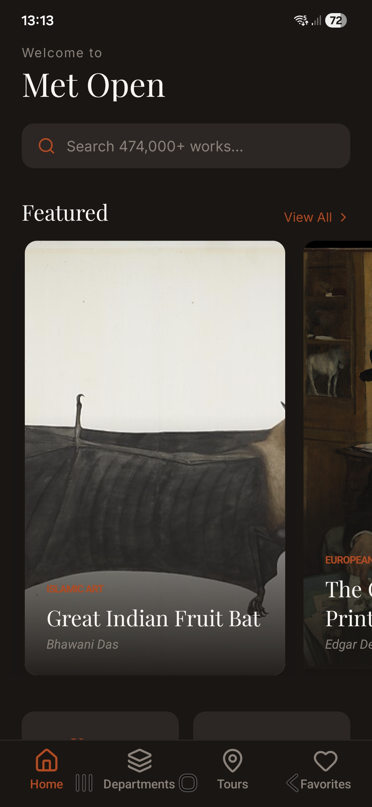

🏛️ Met Open - Museum Explorer

A high-end mobile gallery application built with React Native and Expo, providing a modern interface for the Metropolitan Museum of Art's Open Access collection.

🎨 Design System

This project utilizes a custom design system that bridges code and design:

Styling: NativeWind (https://www.nativewind.dev/) – Tailwind CSS for React Native

Architecture: Centralized design tokens located in theme/tokens.js

Typography:

Playfair Display for elegant museum headings

Inter for clean, legible body text

JetBrains Mono for technical data points

Theme: A sophisticated dark mode utilizing a warm charcoal (#1A1614) and burnt orange (#C2410C) palette

🛠️ Tech Stack

Framework: Expo SDK 54

Routing: Expo Router (file-based navigation)

Icons: Lucide React Native

Visuals: Expo Linear Gradient & Expo Google Fonts

API: The Metropolitan Museum of Art Collection API

🚀 Getting Started

Follow these steps to get the development environment running:

1. Install Dependencies

Because this project uses the latest React 19 features alongside Expo SDK 54, you must use the legacy-peer-deps flag to ensure all library versions align correctly.

Run:
npm install --legacy-peer-deps

2. Start the Development Server

Launch the Metro Bundler with a clean cache to ensure all NativeWind styles and assets are compiled correctly.

Run:
npx expo start -c

3. View the App

Android: Press a to open in the Android Emulator.  
iOS: Press i to open in the iOS Simulator.  
Physical Device: Scan the QR code displayed in your terminal using the Expo Go app (Android) or the Camera app (iOS).

📂 Project Structure

app/ – Main application logic and routing  
app/(tabs)/ – The tab-based navigation group (Home, Departments, etc.)  
theme/ – Source of truth for design tokens (colors, spacing, radius)  
assets/ – Fonts and static image resources.
